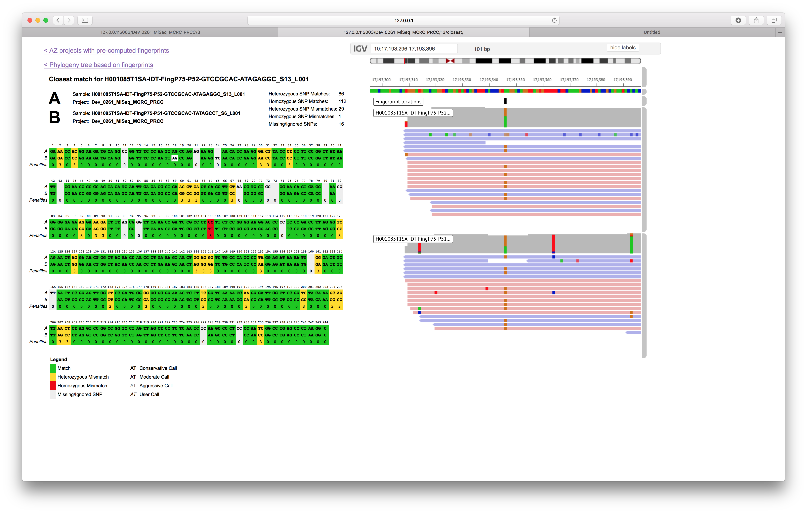
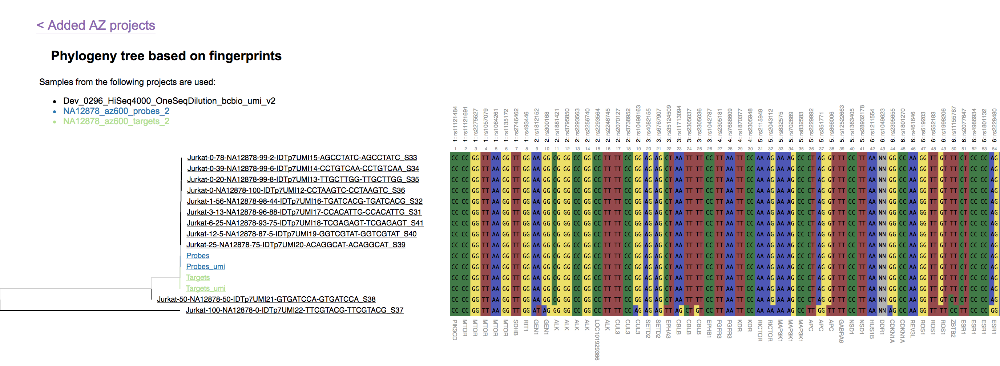

# Sample mix-up check

A tool that checks NGS samples identity accross multiple sequencing projects. 
The input can be sets of BAM files and bcbio-nextgen output folders.
The tools supports comparison against different targets: WGS, exome, small panel. The only requirement 
is that they should overlap so at least 20-30 SNPs are shared between all input samples.





## Installation

### Using conda

Stable release:

```
conda install -c vladsaveliev -c bioconda -c r -c conda-forge python=3.6 clearup
```

From a cloned repo
```
conda env create -n clearup --file environment.yml
source activate clearup
pip install -e .
```

## Running

### Set up

- `python manage.py init_db`
- `python manage.py reload_all_pdata`

### Start server

- `python start.py`

### Add project

- `python manage.py load_project <bcbio_final_path_of_fingerprints_project> --name=<project_name>`

### Load and add project in the AZ US HPC

- `cd /gpfs/group/ngs/src/Fingerprinting-1.1`
- `source load.sh`
- `python manage.py load_bcbio_project <bcbio_final_path_of_fingerprints_project> --name=<project_name>`

## Methods

### How SNPs for fingerprints are selected

* Initially we pre-subset dbSNP by taking only variants matching these restrictions, getting 1738132 SNPs:
    * autosomal,
	* global major allele frequency >10%,
	* single nucleotide change,
	* single allele,
	* with a gene name provided,
	* the gene is out outside of AZ blacklist,
	* postilion is outside of LCR and tricky regions.

* When the analysis of concrete samples is requested, we:
	* overlap the set with all capture panels (for targeted experiments) and callable regions (for WGS),
	* select random 200 genes overlapping the SNPs,
	* for all SNPs in selected 200 genes, select random SNPs so they are at least 500bp distance from each other.

### How the fingerprints are built and compared

* VarDict is run for all input sample on 200 selected SNPS
* For each SNP, we collect the genotype:
   * If VarDict called a confident single-nucleotide variant, we assigned the called genotype,
   * If the call is rejected or indel, or the coverage in the site is below 5x, we use NN as a genotype,
   * If VarDict didn't call anything, but the location is at least 5x of coverage, we call the reference allele.
* SNPs for each sample are concatenated into sequences
* Prank is used to MSA sequences and build a phylogeny tree. 
